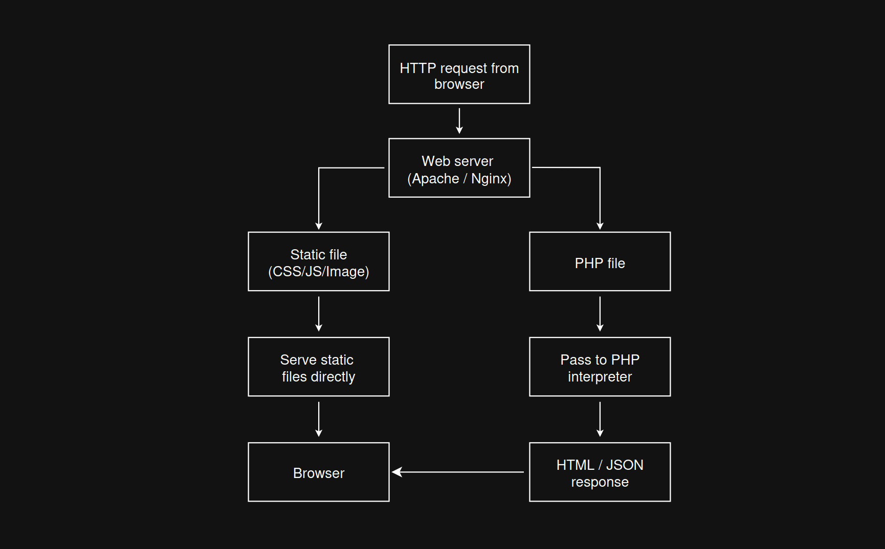

# Apache Request Handling

This diagram shows how a web server such as Apache or Nginx handles different types of requests from the browser. When the browser sends an HTTP request, the web server checks what kind of file is being requested.

If the request is for a static file such as CSS, JavaScript, or an image, the web server can serve that file directly back to the browser.

If the request is for a PHP file, the web server does not send the raw PHP code to the browser. Instead, it passes the file to the PHP interpreter. PHP executes the code on the server and produces an HTML or JSON response, which is then sent back to the browser.

## Key points

- The browser sends an HTTP request to the web server
- Static files can be served directly by Apache or Nginx
- PHP files must be passed to the PHP interpreter
- The browser never receives raw PHP code
- The browser only receives the final response, such as HTML or JSON

## Static file examples

- `style.css`
- `app.js`
- `logo.png`

## PHP file examples

- `index.php`
- `add-note.php`
- `save-note.php`

## Key takeaway

Apache can serve static files directly, but PHP files must be executed on the server before the browser receives the result.