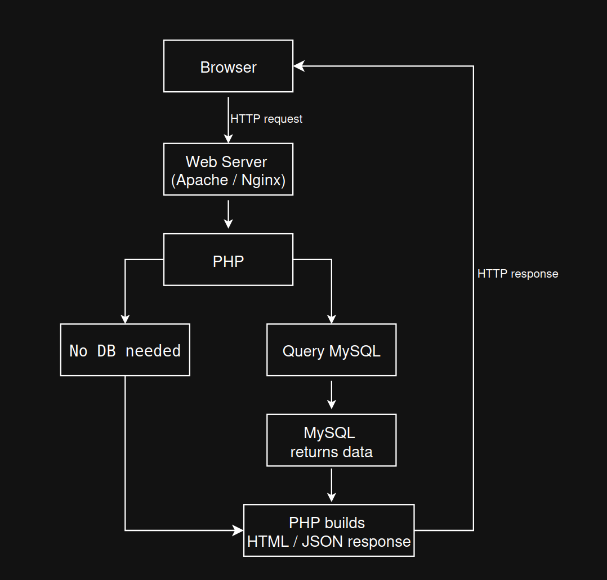

# Where MySQL Fits

This diagram shows where MySQL fits in a PHP web application request. The browser sends an HTTP request to the web server, and the web server passes the request to PHP. PHP is the part of the application that decides what to do next.

Some requests do not need a database. In those cases, PHP can build the response directly.

Other requests need stored data. In those cases, PHP queries MySQL, MySQL returns data back to PHP, and PHP uses that data to build an HTML or JSON response. That response is then sent back to the browser.

## Key points

- MySQL sits behind PHP as the data layer
- The browser does not normally talk directly to MySQL
- PHP decides whether a database query is needed
- MySQL returns data to PHP, not to the browser
- PHP builds the final response that is sent back to the browser

## When MySQL is used

Examples of requests that may use MySQL:
- loading notes from a notes app
- saving a form submission
- showing a product listing
- checking login details
- updating or deleting stored records

## When MySQL may not be used

Examples of requests that may not need MySQL:
- showing a simple hardcoded page
- returning test output from a practice file
- running basic PHP logic or calculations
- route or controller demos without stored data

## Key takeaway

MySQL stores application data, PHP talks to MySQL when needed, and PHP sends the final response back to the browser.